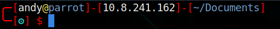

# ZSH Customisations

## Custom ZSH Theme

Place in `~/.oh-my-zsh/themes/`

Edit `~/.zshrc`

`ZSH_THEME="custom"`

## Custom CTF Plugin

Place in `~/.oh-my-zsh/custom/plugins/ctf`

## Custom Plugins

`git clone https://github.com/zsh-users/zsh-autosuggestions ${ZSH_CUSTOM:-~/.oh-my-zsh/custom}/plugins/zsh-autosuggestions`

## Enable
`source .zshrc`
